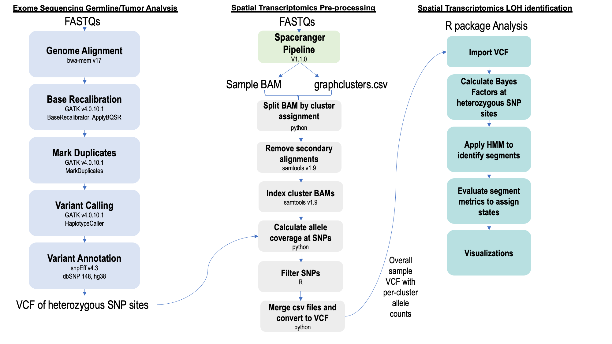
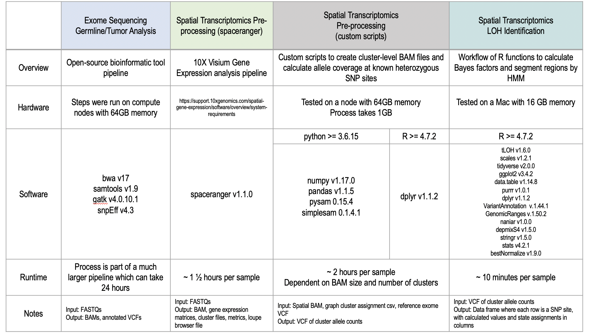
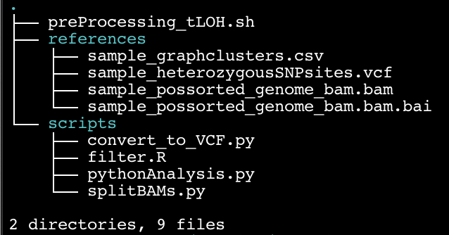

# Spatial Loss of Heterozygosity Identification

The diagram below describes our bioinformatic approach for loss of heterozygosity (LOH) identification in spatial clusters.

## Contents
- Overview
- System Requirements
- Installation Guide
- Demo
- Contact
- References

## Overview



#### Exome Sequencing Germline/Tumor Analysis
Heterozygous SNP sites are first obtained through an exome bioinformatic analysis. FASTQs for germline and tumor are individually aligned to the human GRCh38 reference genome using bwa. GATK base recalibration and duplicate marking tools are applied to the resultant BAMs. GATK HaplotypeCaller is run with a list of both the germline and tumor BAMs as input. The snpEff tool annotates the joint VCF with information from dbSNP 148 (hg38). This VCF is filtered for heterozygous SNP sites. The file ExomeDataPreparation.md contains the primary commands used in this process.

#### Spatial Transcriptomics Pre-processing
Separately, the 10X Genomics spaceranger pipeline (v1.1.0) is run using spatial FASTQs as input. An example command used to start this pipeline is shown in SpatialDataPreparation.md. The two main files that proceed to the following steps of our method are the overall spatial BAM and a cluster .csv file. By default, spaceranger outputs k-means and graph cluster files. This example describes use of the default graph cluster .csv file for a sample. However, clusters can also be determined through use of alternative external tools such as Seurat or SCANPY. These clusters can be input if the file contains two comma separated columns of Barcode and Cluster.

Samples are split by cluster assignments using a python script which was originally based on a 10X Genomics utility which is now subset-bam: https://github.com/10XGenomics/subset-bam. Next, samples are indexed and secondary alignments are removed using samtools v1.9.

A custom script is run to calculate allele counts at known heterozygous SNP sites with the exome sequencing VCF file and primary alignment cluster BAMs as input. The results are filtered in R by strict criteria to obtain high quality variants. The filtered allele count .csv files are merged and converted to VCF format. This VCF is the primary input for our R package tLOH.

#### Spatial Transcriptomics LOH Identification
A sample VCF is imported in R as a dataframe. Bayes factors are calculated at each SNP site. A Hidden Markov model segmentation approach is applied in a per-chromosome, per-cluster system. Cumulative metrics across segments are evaluated to make state determinations of heterozygous, LOH, or undefined. Two plotting functions are provided for output visualization.

The main analysis functions for this process are available through Bioconductor at https://www.bioconductor.org/packages/release/bioc/html/tLOH.html. However, the most recent functions will not be available until the upcoming fall release in October. Therefore, an R script with all updated functions is available in this repository as mainFunctions.R. Function names may be changed in the upcoming update.


## System Requirements
### Hardware Requirements
Our approach for spatial LOH analysis was developed in the following environments:

- Linux CentOS v3.10.0-1062.4.1.el7.x86_64
- Mac OSX v10.14.6

### Software Requirements
The diagram below lists the primary software and hardware requirements to run an analysis. It is important to note that the exome sequencing steps were part of a much larger analysis pipeline, so the general run time is longer than if the steps were processed individually.



### Conda Environment

Specific python (v3.6) packages are required to run the preProcessing_tLOH.sh script.  We utilized conda v4.12.0 in our testing and recommend using a conda environment to ensure correct installation of necessary modules. To generate a conda environment the following commands can be run.

```
conda env create --name spatialEnv --file=spatialProcessingEnvironment.yml
conda activate spatialEnv
```
Alternatively, a new conda environment can be created and each package/version listed in the .yml can be installed individually. For example:

```
conda create -n spatialEnv python=3.6
conda activate spatialEnv
conda config --add channels r
conda config --add channels bioconda
conda install -c bioconda
conda install pysam=0.15.4
conda install [package=version] # add package and version name
```

### Dependencies
Exome Sequencing Germline/Tumor Analysis:       
bwa v17        
samtools v1.9       
gatk v4.0.10.1           
snpEff v4.3         

Spatial Transcriptomics Pre-processing:         
spaceranger v1.1.0                        
Python 3.6.15 (all necessary dependencies in spatialProcessingEnvironment.yml)         
R (>= 4.2.0)

Spatial Transcriptomics LOH Identification: 
R (>= 4.2.0)      
**R packages**          
scales v1.2.1       
tidyverse v2.0.0         
ggplot2 v3.4.2         
data.table v1.14.8        
purrr v1.0.1        
dplyr v1.1.2         
VariantAnnotation  v.1.44.1      
GenomicRanges v.1.50.2         
naniar v1.0.0       
depmixS4 v1.5.0        
stringr v1.5.0       
stats v4.2.1        
bestNormalize v1.9.0


## Installation Guide
### Current Release
The current version of the tLOH R package is v1.5.6. The next version of this package with updated functionality and documentation will be available with the Bioconductor 3.18 release on October 25. 

```
# R v4.2.1
if (!require("BiocManager", quietly = TRUE))
    install.packages("BiocManager")

Biocmanager::install(tLOH)
```
Installation time is approximately five minutes on a Mac computer with 16GB memory and 2.9 GHz Intel Core i7processor.


### Development Version

Updated functions are available in the file mainFunctions.R. As shown in the vignette exampleLOHanalysis.html, the following command can be run in R to load updated functions:

```
# R v4.2.1
source ('~/mainFunctions.R') # adjust path to where this file is located
```


## Demo

Data for this project is available through the NCBI Gene Expression Omnibus. 


#### Exome Sequencing Germline/Tumor Analysis

Details on running the exome sequencing analysis can be found in ExomeDataPreparation.md.

#### Spatial Transcriptomics Pre-processing

The script below, saved as preProcessing_tLOH.sh, runs several steps to prepare a VCF with cluster-specific allele counts at heterozygous SNP sites. To test out this analysis, the path to a testDirectory must be updated in the script. A sample directory tree is also shown.




preProcessing_tLOH.sh:

```
#!/bin/bash

time=`date +%d-%m-%Y-%H-%M`
echo "Start:$time"
echo ' '

conda activate spatialEnv

sample='sampleName'
testDir='testDirectory/' # Edit this path to a location for a test directory
scripts=`echo ${testDir}/scripts` # directory should contain splitBAMs.py, pythonAnalysis.py, convert_to_VCF.py, and filter.R

references=`echo ${testDir}/references` # directory should contain ${sample}_graphclusters.csv, ${sample}_heterozygousSNPsites.vcf, ${sample}_possorted_genome.bam, and ${sample}_possorted_genome.bam.bai

echo '# Splitting BAM to cluster mini-BAMs'
python ${scripts}/splitBAMs.py --bam ${references}/${sample}_possorted_genome_bam.bam --clusters ${references}/${sample}_graphclusters.csv --output ${testDir}/outputBAM

outputBAM=`echo ${testDir}/outputBAM`

echo '# Creating output directories'
mkdir ${outputBAM}/primaryAlignments
mkdir ${testDir}/alleleCounts
mkdir ${testDir}/filteredAlleleCounts

echo '# Removing secondary alignments, indexing BAMs, and calculating allele counts for each cluster'
echo ' '
for i in `ls ${outputBAM}/*bam`; do \

	cluster=`basename ${i}`

	INDEX=`echo ${cluster} | sed 's/[^0-9]//g'`
	echo '# Cluster' ${INDEX}
	echo ' '
 	samtools index ${i}
	samtools view -q30 -b ${i} -F 256 > ${outputBAM}/primaryAlignments/${sample}_cluster${INDEX}_primaryAlignments.bam
	samtools index ${outputBAM}/primaryAlignments/${sample}_cluster${INDEX}_primaryAlignments.bam
	python ${scripts}/pythonAnalysis.py ${references}/${sample}_heterozygousSNPsites.vcf ${outputBAM}/primaryAlignments/${sample}_cluster${INDEX}_primaryAlignments.bam ${sample}_${INDEX} ${testDir}/alleleCounts
done

echo ' '
echo 'Filtering SNP sites'
Rscript ${scripts}/filter.R ${testDir}/alleleCounts
cp -v ${testDir}/alleleCounts/${sample}*filtered*.csv ${testDir}/filteredAlleleCounts
echo '# Merging allele count csv files and converting to VCF format'
echo ' '
python ${scripts}/convert_to_VCF.py ${sample} ${testDir}/filteredAlleleCounts


time=`date +%d-%m-%Y-%H-%M`
echo "End: $time"

```

####  Spatial Transcriptomics LOH Identification


The following code is an R analysis of a spatial sample after exome analysis and spaceranger processing has completed. An example with output is attached as exampleLOHanalysis.html.

```
# R v4.2.1
library(tLOH)
data('initialStartProbabilities')
source ('~/mainFunctions.R')

# Import VCF of all spatial sample allele counts at known heterozygous SNP sites
importedData <- importVCF('sample_tLOH.vcf')

# Calculate Bayes factor values at each SNP site
bayesCalculations <- tLOHCalcUpdate(importedData, 1.25,1.25,500,500,4)

# Apply HMM to identify segments and annotate with state assignments
hmmOutput <- hiddenMarkovAnalysis2(bayesCalculations, initialStartProbabilities)

# Visualize final results
plot1 <- plotSegments(hmmOutput)
plot2 <- plotAlleleFractions(hmmOutput)

# Visualize final results
plot1
plot2 

```

## Contact
**Michelle G. Webb**      
michelgw@usc.edu

## References
**10X Visium Spatial Gene Expression** https://www.10xgenomics.com/products/spatial-gene-expression              
**R:** R Core Team (2019). R: A language and environment for statistical computing. R Foundation for Statistical Computing, Vienna, Austria. URL https://www.R-project.org/.          
**depmixS4** Visser I, Speekenbrink M (2010). “depmixS4: An R Package for Hidden Markov Models.” Journal of Statistical Software, 36(7), 1–21. https://www.jstatsoft.org/v36/i07/.          
**scales:** Hadley Wickham and Dana Seidel (2020). scales: Scale Functions for Visualization. R package version 1.1.1. https://CRAN.R-project.org/package=scales                          
**tidyverse:** Wickham et al., (2019). Welcome to the tidyverse. Journal of Open Source Software, 4(43), 1686, https://doi.org/10.21105/joss.01686          
**ggplot2:** H. Wickham. ggplot2: Elegant Graphics for Data Analysis. Springer-Verlag New York 2016.                
**data.table:** Matt Dowle and Arun Srinivasan (2020). data.table: Extension of \`data.frame\`. R package version 1.13.0. https://CRAN.R-project.org/package=data.table                   
**purrr:** Lionel Henry and Hadley Wickham (2020). purrr: Functional Programming Tools. R package version 0.3.4. https://CRAN.R-project.org/package=purrr                           
**dplyr:** Hadley Wickham, Romain François, Lionel Henry and Kirill Müller (2020). dplyr: A Grammar of Data Manipulation. R package version 1.0.0. https://CRAN.R-project.org/package=dplyr                                 
**VariantAnnotation:** Obenchain V, Lawrence M, Carey V, Gogarten S, Shannon P, Morgan M (2014).
“VariantAnnotation: a Bioconductor package for exploration and annotation of
genetic variants.” _Bioinformatics_, *30*(14), 2076-2078. doi:
10.1093/bioinformatics/btu168 (URL:
https://doi.org/10.1093/bioinformatics/btu168).                 
**GenomicRanges:** Lawrence M, Huber W, Pag\`es H, Aboyoun P, Carlson M, et al. (2013) Software
  for Computing and Annotating Genomic Ranges. PLoS Comput Biol 9(8): e1003118.
  doi:10.1371/journal.pcbi.1003118                        
**Bayes factors** Jeffreys, Harold (1998) [1961]. The Theory of Probability(3rd ed.). 
Oxford, England. p. 432. ISBN 9780191589676.                 
**Best Normalize** Peterson RA (2021). “Finding Optimal Normalizing Transformations via bestNormalize.” The R Journal, 13(1), 310–329. doi:10.32614/RJ-2021-041.
Peterson RA, Cavanaugh JE (2020). “Ordered quantile normalization: a semiparametric transformation built for the cross-validation era.” Journal of Applied Statistics, 47(13-15), 2312-2327. doi:10.1080/02664763.2019.1630372.                  
**Naniar** https://cran.r-project.org/web/packages/naniar/index.html


