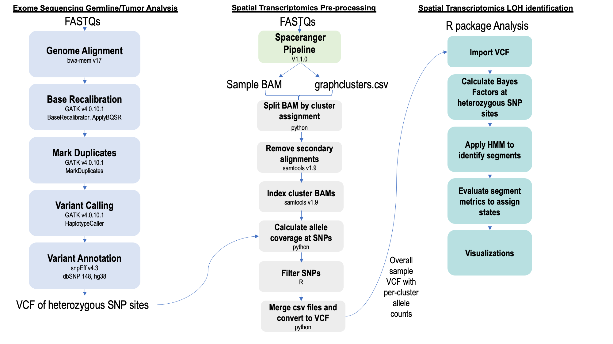

#Spatial Loss of Heterozygosity Identification

The diagram below describes our bioinformatic approach for loss of heterozygosity (LOH) identification in spatial clusters.

## Contents
- Bioinformatic Approach
- Example Analysis
- Dependencies
- Contact

## Bioinformatic Approach



#### Exome Sequencing Germline/Tumor Analysis
Heterozygous SNP sites are first obtained through an exome bioinformatic analysis. FASTQs for germline and tumor are individually aligned to the human GRCh38 reference genome using bwa. GATK base recalibration and duplicate marking tools are applied to the resultant BAMs. GATK HaplotypeCaller is run with a list of both the germline and tumor BAMs as input. The snpEff tool annotates the joint VCF with information from dbSNP 148 (hg38). This VCF is filtered for heterozygous SNP sites. The file ExomeDataPreparation.md contains the primary commands used in this process.

#### Spatial Transcriptomics Pre-processing
Separately, the 10X Genomics spaceranger pipeline (v1.1.0) is run using spatial FASTQs as input. An example command used to start this pipeline is shown in SpatialDataPreparation.md. The two main files that proceed to the following steps of our method are the overall spatial BAM and a cluster .csv file. By default, spaceranger outputs k-means and graph cluster files. This example describes use of the default graph cluster .csv file for a sample. However, clusters can also be determined through use of alternative external tools such as Seurat or SCANPY. These clusters can be input if the file contains two comma separated columns of Barcode and Cluster.

Samples are split by cluster assignments using a python script which was originally based on a 10X Genomics utility which is now subset-bam: https://github.com/10XGenomics/subset-bam. Next, samples are indexed and secondary alignments are removed using samtools v1.9.

A custom script is run to calculate allele counts at known heterozygous SNP sites with the exome sequencing VCF file and primary alignment cluster BAMs as input. The results are filtered in R by strict criteria to obtain high quality variants. The filtered allele count .csv files are merged and converted to VCF format. This VCF is the primary input for our R package tLOH.

#### Spatial Transcriptomics LOH Identification
A sample VCF is imported in R as a dataframe. Bayes factors are calculated at each SNP site. A Hidden Markov model segmentation approach is applied in a per-chromosome, per-cluster system. Cumulative metrics across segments are evaluated to make state determinations of heterozygous, LOH, or undefined. Two plotting functions are provided for output visualization.

The main analysis functions for this process are available through Bioconductor at https://www.bioconductor.org/packages/release/bioc/html/tLOH.html. However, the most recent functions will not be available until the upcoming fall release in October. Therefore, an R script with all updated functions is available in this repository as functions.R.

## Example Analysis

An example analysis is described in the exampleLOH_analysis.html vignette. To run an example analysis from pre-procesing, the following files will be used as input:          

1. spatial transcriptomics BAM # available at NCBI GEO
2. graphclusters.csv # available at NCBI GEO
3. filtered and annotated exome VCF file # example in references directory


## Dependencies

Exome Analysis:       
bwa         
samtools          
gatk           
snpEff          

Spatial Pre-processing Analysis:                 
Python 3.6.15 (all package dependencies shown in spatialProcessingEnvironment.yml)         

## Conda environment setup

Specific python (v3.6) packages are required to run the preProcessing_tLOH.sh script. The spatial ProcessingEnvironment.yml file lists these functions. To generate a conda environment which contains these packages, the following commands can be run.

```
conda env create --name spatialEnv --file=spatialProcessingEnvironment.yml
```
Alternatively, a new conda environment can be created and each package/version listed in the .yml can be installed. For example:

```
conda create -n myEnv python=3.6
conda activate myEnv
conda config --add channels r
conda config --add channels bioconda
conda install -c bioconda
conda install pysam=0.15.4
conda install [package=version] # add package and version name
```

## Contact
**Michelle G. Webb**      
michelgw@usc.edu

## References


